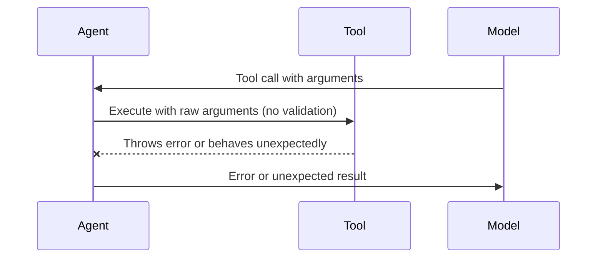
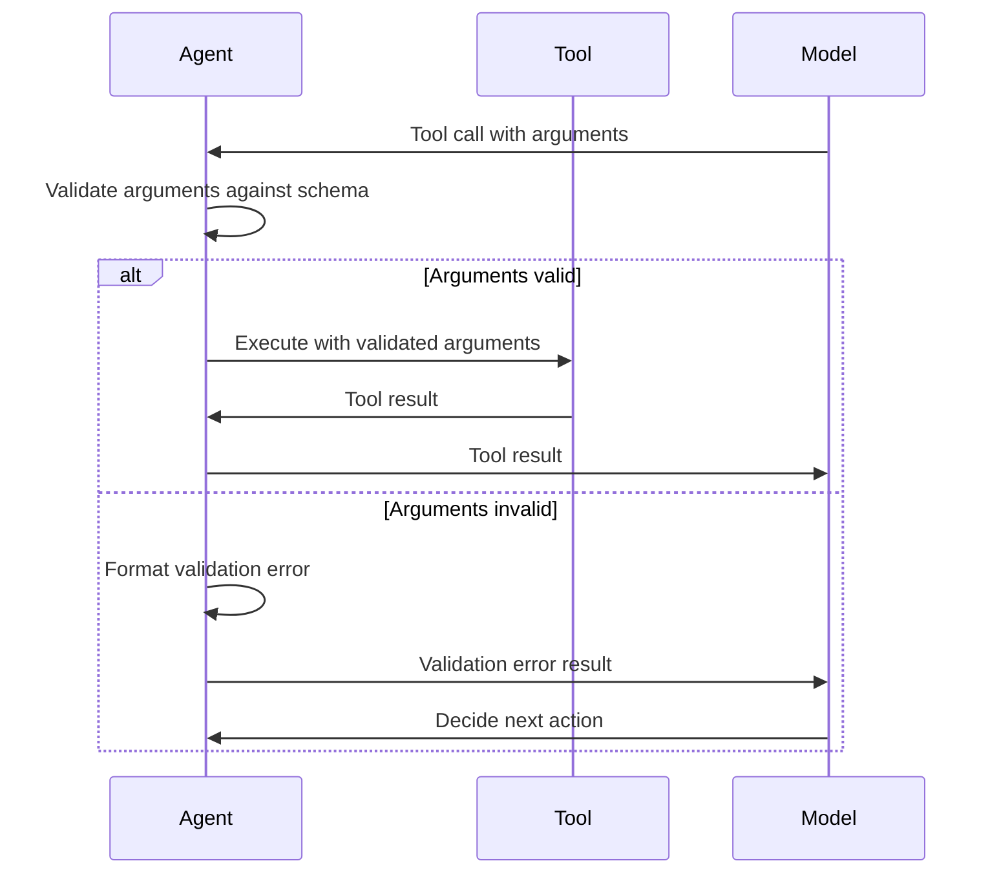

# Task 007: Add Tool Argument Validation

## Task Metadata

| Property | Value |
|----------|-------|
| **ID** | 007 |
| **Name** | Add tool argument validation |
| **Wave** | 4 (Quality Assurance Phase) |
| **Estimated Duration** | 30 minutes |
| **Category** | Refactor |
| **Priority** | High |
| **Dependencies** | 004, 005 |
| **Status** | Pending |

## Objective

Implement runtime validation of tool arguments against their JSON schemas using Zod. Create a `validateToolArguments()` function with clear error messages and integrate it into the tool execution loop in `agent.ts`. This ensures that all tool invocations receive properly typed and validated arguments before execution, preventing runtime errors and providing clear feedback when validation fails.

## Context

### Functional Requirement

**Tool Argument Validation**
- Validate tool arguments against their JSON schemas at runtime
- Parse and validate arguments using Zod schema validation
- Provide clear, actionable error messages for validation failures
- Prevent invalid tool calls from executing
- Log validation errors with full context

**User Story**: As a developer using @schaakesolutionsllc/agents, I want tool arguments to be validated at runtime so that invalid or malformed arguments are caught early with clear error messages, preventing tool execution errors and improving debugging experience.

### Current Issue

The agent execution loop in `src/agent.ts` processes tool calls directly without validating that the provided arguments match the tool's expected schema. This can lead to:

1. **Silent failures** - tools receive unexpected argument types
2. **Cryptic errors** - runtime type errors in tool handlers
3. **Poor debugging** - hard to identify argument mismatches
4. **Security concerns** - no validation of argument values

**Current Flow (no validation)**:


### Desired Flow (with validation)



### Design Specification

Implement a `validateToolArguments()` function that:

1. **Accepts parameters**:
   - Tool name (for error messages)
   - Arguments object (from model's tool call)
   - JSON schema (from tool definition)

2. **Validates arguments**:
   - Parse arguments using Zod schema
   - Handle type mismatches and missing required fields
   - Catch validation errors safely

3. **Reports errors**:
   - Throw descriptive error with field-level details
   - Include validation error context (which field, what was expected)
   - Provide error messages suitable for model consumption

4. **Integration**:
   - Call before tool handler execution in the run loop
   - Treat validation errors like handler errors
   - Return error result to model instead of crashing

**Reference Implementation Pattern**:
```typescript
function validateToolArguments(toolName: string, args: unknown, schema: ZodSchema): void {
  const result = schema.safeParse(args);
  if (!result.success) {
    throw new Error(`Tool argument validation failed for ${toolName}: ${formatZodErrors(result.error)}`);
  }
}
```

### Architecture Context

**File Structure**:
```
src/
├── agent.ts          # Main file - Tool execution loop (MODIFIED)
├── openrouter.ts     # OpenRouter provider (no changes needed)
├── tools.ts          # Tool definition helpers (no changes needed)
├── types.ts          # Type definitions (may reference Zod schemas)
├── validation.ts     # (NEW) Validation utilities
├── index.ts          # Public exports (no changes needed)
└── errors.ts         # (FUTURE) Custom error classes
```

**Key File**: `src/agent.ts` - Where tool handlers are executed and where argument validation needs to be integrated.

**Related Files**:
- Task 004 (dependency): Schema definitions setup
- Task 005 (dependency): Zod integration/available
- Existing validation patterns from prior tasks

## Acceptance Criteria

All of the following must be true for this task to be complete:

1. **Validation Function**
   - [ ] `validateToolArguments(toolName, args, schema)` function exists
   - [ ] Function uses Zod schema.safeParse() for validation
   - [ ] Function is clearly documented with JSDoc
   - [ ] Function handles all argument types correctly

2. **Error Messages**
   - [ ] Validation errors are formatted clearly
   - [ ] Error messages include tool name
   - [ ] Error messages indicate which field failed validation
   - [ ] Error messages explain what was expected vs. received
   - [ ] Error messages are suitable for model consumption (not raw Zod errors)

3. **Integration in Agent Loop**
   - [ ] Tool arguments are validated before handler execution
   - [ ] Validation occurs for every tool call
   - [ ] Validation errors are caught and formatted as tool result errors
   - [ ] Agent continues operation after validation error (doesn't crash)

4. **Tool Result Format**
   - [ ] Validation errors returned to model in same format as other tool errors
   - [ ] Error results include tool call ID/reference
   - [ ] Error results include clear validation failure message
   - [ ] Model receives error information for decision-making

5. **Testing**
   - [ ] Write test: validation passes with correct arguments
   - [ ] Write test: validation fails with missing required field
   - [ ] Write test: validation fails with wrong type
   - [ ] Write test: validation fails with invalid field value
   - [ ] Write test: agent continues after validation error
   - [ ] Write test: model receives validation error result
   - [ ] Existing tests continue to pass

6. **Code Quality**
   - [ ] Function is pure and testable
   - [ ] No console.log statements (use proper logging)
   - [ ] Follows existing code style and patterns
   - [ ] Error handling is comprehensive

## Implementation Steps

### Step 1: Analyze Existing Tool Schemas

1. Open `/home/markschaake/projects/schaake-agents/src/agent.ts`
2. Examine how tools are defined and how their schemas are structured
3. Identify:
   - Where tool definitions/schemas come from
   - Current schema format (JSON, Zod, other)
   - Where tool calls are processed in the run loop
   - How arguments are currently passed to handlers
   - Where validation could be inserted

### Step 2: Review Task 004 and 005 Output

1. Examine Task 004 implementation for schema setup
2. Examine Task 005 implementation for Zod integration
3. Understand:
   - How schemas are structured
   - Zod library usage patterns
   - Available utilities for validation
   - Error handling patterns used

### Step 3: Design Validation Function

1. Create validation function signature:
   ```typescript
   function validateToolArguments(
     toolName: string,
     args: unknown,
     schema: ZodSchema
   ): void
   ```

2. Determine error message format:
   - What information to include from Zod validation errors
   - How to format field-level error messages
   - Whether to include suggestions or examples

3. Plan error throwing mechanism:
   - Create clear error messages
   - Include all necessary context
   - Ensure errors can be caught and formatted as tool results

### Step 4: Implement Validation Function

1. Create or update validation module (in `src/agent.ts` or separate file)
2. Implement function:
   - Call `schema.safeParse(args)`
   - Check `result.success` boolean
   - Format Zod errors into readable message
   - Throw Error with formatted message

3. Handle edge cases:
   - `args` is null/undefined
   - `schema` is invalid
   - Zod errors with nested field paths
   - Custom error messages from schema

4. Add JSDoc documentation:
   - Parameter descriptions
   - Return value documentation
   - Error throwing documentation
   - Usage examples

### Step 5: Integrate into Agent Run Loop

1. **Locate handler execution** in `agent.ts` run loop
2. **Add validation call** before handler execution:
   ```typescript
   try {
     // Validate arguments before execution
     validateToolArguments(toolName, toolCall.function.arguments, toolSchema);
     // Then execute handler
     const result = await toolHandler(toolCall.function.arguments);
   } catch (error) {
     // Format as tool error result (same as handler errors)
   }
   ```

3. **Ensure proper error handling**:
   - Validation errors should be caught by same error handler
   - Error results should be formatted consistently
   - Agent loop should continue

### Step 6: Handle Validation Error Results

1. **Format validation errors** as tool result messages:
   - Include tool call ID/reference
   - Include clear error message
   - Follow same format as handler error results

2. **Add to message history**:
   - Include validation error in messages sent to model
   - Model can use error information for next action

### Step 7: Write Comprehensive Tests

Create tests in `/home/markschaake/projects/schaake-agents/tests/agent.test.ts`:

1. **Test: Valid arguments pass validation**
   ```typescript
   it('should validate tool arguments that match schema', async () => {
     // Arrange: Tool with schema, call with matching arguments
     // Act: Validate arguments
     // Assert: No error thrown
   });
   ```

2. **Test: Missing required field fails**
   ```typescript
   it('should reject arguments with missing required fields', async () => {
     // Arrange: Tool with required field, call without it
     // Act: Validate arguments
     // Assert: Error thrown with field name
   });
   ```

3. **Test: Wrong type fails**
   ```typescript
   it('should reject arguments with wrong type', async () => {
     // Arrange: Tool expects number, receives string
     // Act: Validate arguments
     // Assert: Error thrown with type information
   });
   ```

4. **Test: Invalid field value fails**
   ```typescript
   it('should reject arguments with invalid values', async () => {
     // Arrange: Tool with validation (e.g., min/max), invalid value
     // Act: Validate arguments
     // Assert: Error thrown with validation details
   });
   ```

5. **Test: Agent continues after validation error**
   ```typescript
   it('should format validation errors as tool results and continue', async () => {
     // Arrange: Tool call with invalid arguments
     // Act: Run agent
     // Assert: Agent didn't crash, error result in messages, continues operation
   });
   ```

6. **Test: Model receives validation error**
   ```typescript
   it('should pass validation errors to model in tool result format', async () => {
     // Arrange: Invalid tool call
     // Act: Run agent
     // Assert: Model receives error in expected format
   });
   ```

### Step 8: Verify All Tests Pass

1. Run full test suite: `npm test`
2. Ensure no regressions from other tasks
3. All tests should pass
4. Check test coverage for validation function

## Files to Modify

### Primary Files

| File Path | Changes | Priority |
|-----------|---------|----------|
| `/home/markschaake/projects/schaake-agents/src/agent.ts` | Integrate validateToolArguments() before tool handler execution | High |
| `/home/markschaake/projects/schaake-agents/tests/agent.test.ts` | Add comprehensive tests for argument validation | High |

### Conditional/Secondary Files

| File Path | Changes | Condition |
|-----------|---------|-----------|
| `/home/markschaake/projects/schaake-agents/src/validation.ts` | Create validation utilities module (if separate module preferred) | Optional |
| `/home/markschaake/projects/schaake-agents/src/types.ts` | Add validation error types if needed | If new types required |

## Technical Considerations

### Zod Integration

- Leverage Zod's `safeParse()` method for safe validation
- Use `ZodError` properties to extract field-level details
- Consider Zod error formatting libraries if available
- Ensure compatibility with existing schema definitions

### Error Message Clarity

- Extract field names from Zod error paths
- Include type information (expected vs. received)
- Provide context about which argument failed
- Avoid raw Zod error objects (user-unfriendly)

### Performance

- Validation adds minimal overhead (schema parsing is fast)
- Consider caching compiled schemas if needed
- Validate at call time (when arguments are available)

### Backward Compatibility

- This change is internal to the run loop
- No changes to public API
- No changes to tool definition format
- Existing code continues to work unchanged

### Integration with Dependencies

- Depends on Task 004 for schema availability
- Depends on Task 005 for Zod integration setup
- Should work with existing error handling from Task 001
- Should integrate smoothly with Task 002 (API key validation)

### Edge Cases to Handle

1. **Null/undefined arguments** - handle gracefully
2. **Empty arguments object** - validate required fields
3. **Extra fields in arguments** - consider strictness (Zod option)
4. **Nested object validation** - Zod handles automatically
5. **Array arguments** - Zod array validation
6. **Custom error messages** - preserve schema-defined messages
7. **Large/complex objects** - validation performance

## Success Criteria Summary

The implementation is successful when:

1. ✓ `validateToolArguments()` function exists and is well-documented
2. ✓ Function uses Zod schema.safeParse() for validation
3. ✓ Error messages are clear and field-specific
4. ✓ Validation is integrated into agent run loop before handler execution
5. ✓ Validation errors are caught and formatted as tool result errors
6. ✓ Agent loop continues instead of crashing on validation error
7. ✓ Model receives validation errors as tool results
8. ✓ Comprehensive tests verify all validation scenarios
9. ✓ All existing tests pass
10. ✓ No breaking changes to public API

## References

**Spec Files**:
- Requirements: `/home/markschaake/projects/schaake-agents/specs/backlog/agents-code-quality-phase2/requirements.md`
- Design: `/home/markschaake/projects/schaake-agents/specs/backlog/agents-code-quality-phase2/design.md`

**Related Tasks**:
- Task 004: Schema Setup (dependency)
- Task 005: Zod Integration (dependency)
- Task 001: Tool Handler Error Catching (related error handling)
- Task 002: API Key Validation (similar validation pattern)

**Documentation**:
- Zod Documentation: https://zod.dev
- Zod Error Handling: https://zod.dev?id=error-handling
- Zod Type Inference: https://zod.dev?id=type-inference

## Notes

### Implementation Approach

This task follows the error handling pattern established in Task 001:
1. Validation errors are caught in the same try-catch block as handler errors
2. Errors are formatted consistently as tool result messages
3. Agent loop continues after validation failures
4. Model receives errors for intelligent handling

### Wave 4 Dependency Handling

This task is in Wave 4 and depends on Tasks 004 and 005:
- Ensure Task 004 and 005 are completed first
- Review their implementations to understand schema format
- Build on their patterns for consistency

### Testing Strategy

Validation testing requires:
1. Mock tools with different schema requirements
2. Test data covering all validation failure modes
3. Integration tests showing agent behavior with validation errors
4. Regression tests for existing functionality

### Future Improvements

Once this task is complete:
- Task 008+: May depend on validation infrastructure
- Enhanced logging: Could add detailed validation logs
- Custom error types: Could create ValidationError class
- Validation middleware: Could extract into separate layer

### Common Pitfalls

Avoid these mistakes:
1. Using `schema.parse()` instead of `schema.safeParse()` (throws instead of returns error)
2. Passing raw Zod errors to model (too verbose/technical)
3. Stopping agent on validation error instead of continuing
4. Not logging validation failures for debugging
5. Forgetting to validate for every tool call
6. Creating overly complex error message formatting
