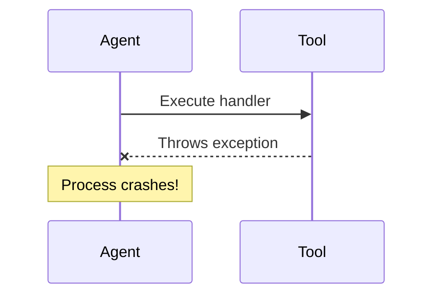
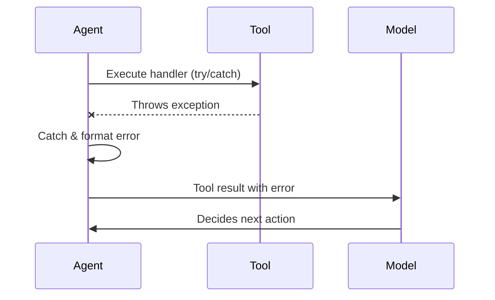

# Task 001: Implement Tool Handler Error Catching

## Task Metadata

| Property | Value |
|----------|-------|
| **ID** | 001 |
| **Name** | Implement tool handler error catching |
| **Wave** | 1 (Critical Phase) |
| **Estimated Duration** | 30 minutes |
| **Category** | Service/Core Feature |
| **Priority** | Critical |
| **Dependencies** | None |
| **Status** | Pending |

## Objective

Implement robust error handling in the agent run loop to wrap tool handler execution in try-catch blocks. When a tool handler throws an exception, catch it, format it as an error result, and return it to the model instead of crashing the agent. This allows the agent to continue operating and the model to decide the next action based on the failure.

## Context

### Functional Requirement (FR-1)

**Tool Handler Error Handling**
- Wrap tool handler execution in try-catch
- Report errors back to model as tool results (not crashes)
- Log handler errors with context
- Allow agent to continue after tool failures

**User Story**: As a developer using @schaakesolutionsllc/agents, I want tools to fail gracefully with informative errors so that my agent can recover and inform the model of failures instead of crashing.

### Current Issue

The agent run loop in `src/agent.ts` executes tool handlers directly without error wrapping. If a tool handler throws an exception, it propagates up and crashes the entire agent, preventing graceful error recovery.

**Current Flow (crashes on error)**:


### Desired Flow (graceful handling)



### Design Specification

Tool handler execution should be wrapped in a try-catch block that:

1. **Executes the handler** wrapped in try-catch
2. **Catches exceptions** and formats them as tool results
3. **Logs the error** with full context (tool name, arguments, error message, stack trace)
4. **Continues operation** by returning the error result to the model

The error result format should follow the tool result message pattern and include:
- Tool name
- Execution status (error)
- Error message (user-friendly)
- Error details (for debugging in logs)

### Architecture Context

**File Structure**:
```
src/
├── agent.ts          # Main file - Tool execution loop lives here
├── openrouter.ts     # OpenRouter provider (no changes needed for this task)
├── tools.ts          # Tool definition helpers (no changes needed for this task)
├── types.ts          # Type definitions (may add error types if needed)
├── index.ts          # Public exports (no changes needed for this task)
└── errors.ts         # (FUTURE) Custom error classes
```

**Key File**: `src/agent.ts` - This is where the tool handler execution happens and where try-catch wrapping needs to be added.

## Acceptance Criteria

All of the following must be true for this task to be complete:

1. **Error Catching**
   - [ ] Tool handlers are wrapped in try-catch blocks
   - [ ] All exception types are caught (Error, custom errors, unknown types)
   - [ ] Agent does not crash when tool handler throws

2. **Error Reporting**
   - [ ] Tool execution errors are formatted as tool result messages
   - [ ] Error results are passed back to the model for decision-making
   - [ ] Model receives error information in the same format as successful tool results
   - [ ] The run loop continues after handling the error

3. **Logging**
   - [ ] Handler errors are logged with tool name
   - [ ] Error messages and stack traces are captured in logs
   - [ ] Context information (iteration, tool name, arguments) is included in logs
   - [ ] Logs use consistent format with existing agent logs

4. **Error Message Format**
   - [ ] Error messages are user-friendly but informative
   - [ ] Error message indicates which tool failed
   - [ ] Error message includes the exception message
   - [ ] Stack traces are available in logs but not exposed to model by default

5. **Testing**
   - [ ] Write test case: handler throws and error is caught
   - [ ] Write test case: agent continues after tool error
   - [ ] Write test case: model receives error result
   - [ ] Existing tests continue to pass

## Implementation Steps

### Step 1: Analyze Current Code

1. Open `/home/markschaake/projects/schaake-agents/src/agent.ts`
2. Locate the tool handler execution code (likely in the run loop where tool calls are processed)
3. Identify:
   - Where handlers are called
   - Current error handling (if any)
   - How tool results are formatted
   - How the message history is maintained
   - Logging mechanism in use

### Step 2: Design Error Result Format

Determine the structure for error results returned to the model:

1. Check existing tool result format in the codebase
2. Design error result structure that mirrors successful results:
   - Should include tool_id/call_id
   - Should include tool name
   - Should include error message (not full stack trace)
   - Should be distinguishable as an error (e.g., status field)
3. Ensure format is compatible with the OpenRouter API expectations for tool results

### Step 3: Implement Try-Catch Wrapping

1. **Locate handler execution** in the run loop (likely in a function that processes tool calls)
2. **Wrap handler execution** in try-catch:
   ```typescript
   try {
     const result = await toolHandler(...args);
     // Handle success
   } catch (error) {
     // Handle error - format and return as tool result
   }
   ```
3. **Handle different error types**:
   - `Error` instances (standard JS errors)
   - Custom error types
   - Unknown/any types (edge case)
4. **Log the error** with context using the existing logging mechanism
5. **Format error result** according to design from Step 2
6. **Add error result** to messages array to be sent back to model

### Step 4: Implement Error Logging

1. **Add logging call** when error is caught
2. **Log format should include**:
   - Tool name
   - Error message
   - Error stack trace
   - Arguments that were passed
   - Iteration number (if available)
3. **Use existing logger** from agent's metadata or context
4. **Avoid logging sensitive data** in error messages

### Step 5: Add Type Definitions (if needed)

If new error message types are needed:

1. Update `/home/markschaake/projects/schaake-agents/src/types.ts`
2. Add type for error tool results
3. Ensure compatibility with existing Message type structure

### Step 6: Write Tests

Create or update tests in `/home/markschaake/projects/schaake-agents/tests/agent.test.ts`:

1. **Test case: Tool handler throws Error**
   ```typescript
   it('should catch and report tool handler exceptions', async () => {
     // Arrange: Create agent with tool that throws
     // Act: Call agent.run()
     // Assert: Agent did not crash, error result in messages
   });
   ```

2. **Test case: Agent continues after error**
   ```typescript
   it('should allow agent to continue after tool error', async () => {
     // Arrange: Tool that throws, then model handles error gracefully
     // Act: Run agent
     // Assert: Multiple iterations occurred despite error
   });
   ```

3. **Test case: Error format is correct**
   ```typescript
   it('should format tool errors as proper tool results', async () => {
     // Arrange: Tool that throws
     // Act: Run agent
     // Assert: Error message has expected structure
   });
   ```

### Step 7: Verify Existing Tests Pass

1. Run existing test suite: `npm test` or `npm run test`
2. Ensure no regressions
3. All tests should pass

## Files to Modify

### Primary Files

| File Path | Changes | Priority |
|-----------|---------|----------|
| `/home/markschaake/projects/schaake-agents/src/agent.ts` | Add try-catch wrapping around tool handler execution | High |
| `/home/markschaake/projects/schaake-agents/tests/agent.test.ts` | Add tests for error catching and continuation | High |

### Conditional/Secondary Files

| File Path | Changes | Condition |
|-----------|---------|-----------|
| `/home/markschaake/projects/schaake-agents/src/types.ts` | Add error result type definitions | If new types are needed |

## Technical Considerations

### Error Message Sanitization

- Avoid including sensitive information in error messages sent to the model
- Stack traces should go to logs only, not to model
- User-friendly error messages should be created for model consumption

### Backward Compatibility

- This change is entirely internal to the run loop
- No public API changes
- All existing code continues to work unchanged
- Error handling is purely additive

### Logging Context

- Use existing logging mechanism (likely `metadata.logger` based on requirements)
- Include iteration count if available
- Include tool name, arguments in logs
- Consider structured logging for easier debugging

### Edge Cases to Handle

1. **Handler returns undefined/void** - already handled, should work
2. **Handler times out** - depends on implementation, may need separate timeout handling
3. **Handler throws non-Error objects** - catch all types with `as Error`
4. **Handler throws null/undefined** - handle gracefully
5. **Multiple sequential tool calls** - each independently wrapped

## Success Criteria Summary

The implementation is successful when:

1. ✓ Tool handlers are wrapped in try-catch blocks in the agent run loop
2. ✓ Tool exceptions are caught and formatted as error results
3. ✓ Error results are included in the message history sent back to the model
4. ✓ Agent loop continues instead of crashing
5. ✓ Errors are logged with tool name, error message, and context
6. ✓ Tests verify error catching and agent continuation
7. ✓ All existing tests pass
8. ✓ No breaking changes to public API

## References

**Spec Files**:
- Requirements: `/home/markschaake/projects/schaake-agents/specs/backlog/agents-codebase-improvements/requirements.md` (FR-1)
- Design: `/home/markschaake/projects/schaake-agents/specs/backlog/agents-codebase-improvements/design.md` (Workflow 1)

**Related Acceptance Criteria** (from parent spec):
- Tool handler exceptions are caught and reported to model, not thrown
- All existing tests continue to pass

## Notes

### Implementation Order

This task should be completed first in Wave 1 because:
1. It's critical for production stability
2. It has no dependencies
3. It's relatively small (30 minutes estimated)
4. It unblocks other error handling improvements

### Future Improvements

Once this task is complete, the following related tasks can proceed:
- Task 002: API Key Validation (depends on error handling pattern)
- Task 003+: Streaming support, type safety, etc.

### Debugging Tips

If you encounter issues:

1. **How to find handler execution**: Search for where tool calls are processed in agent.ts
2. **Message format**: Look for existing code that adds results to messages array
3. **Logging**: Check if `metadata.logger` or another logging mechanism exists
4. **Type checking**: Look at OpenRouter SDK types for tool call format
