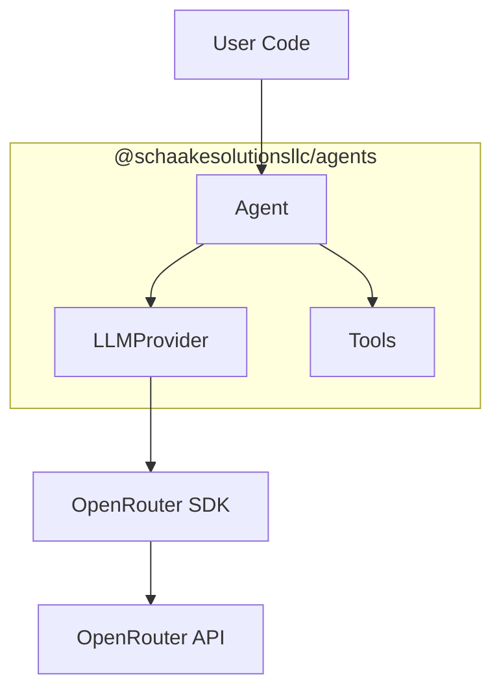
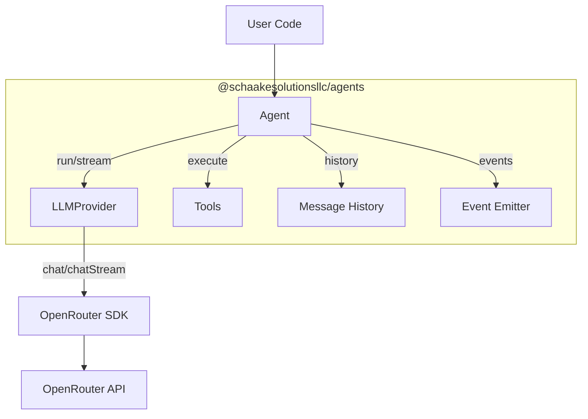
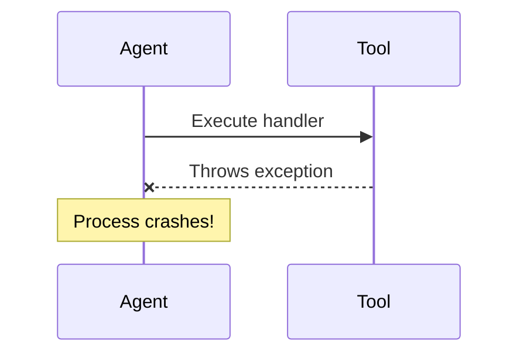
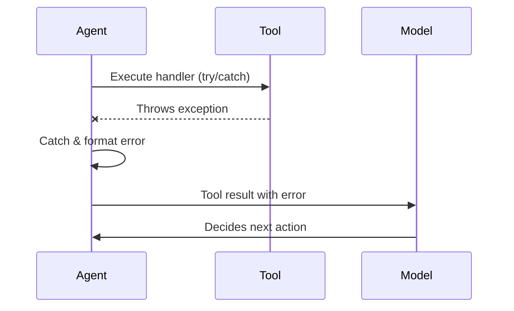
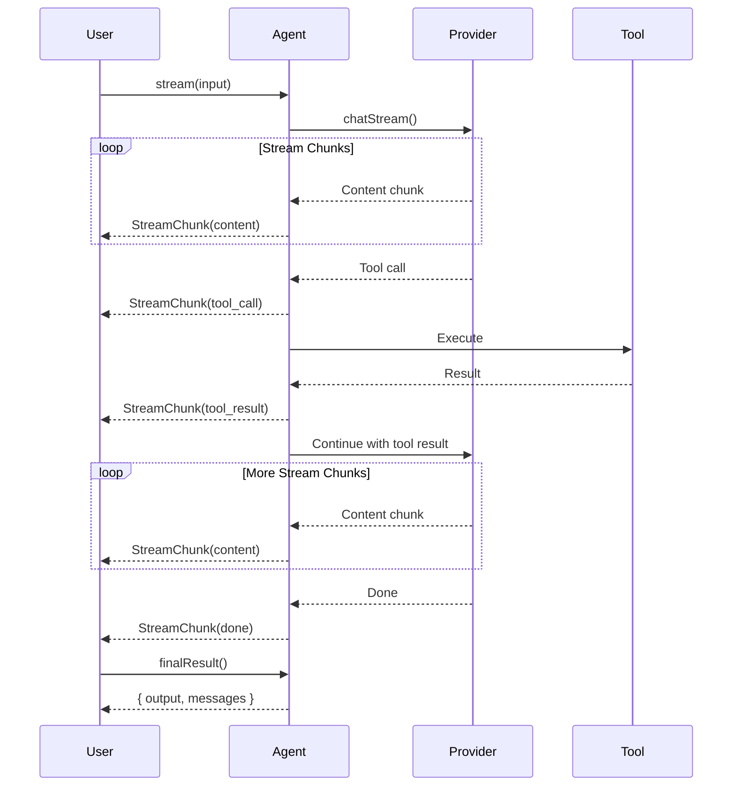

# Agents Codebase Improvements - Design

## Project Scope

**Affected Projects/Packages**:

- [x] `src/agent.ts` - Error handling, type safety, API improvements
- [x] `src/openrouter.ts` - Type safety, validation
- [x] `src/types.ts` - Type definitions, API design
- [x] `tests/` - Comprehensive test coverage

**Scope Type**: Single Project

**Primary Project**: @schaakesolutionsllc/agents

**Status**: Draft

---

## Architecture Overview

The @schaakesolutionsllc/agents library follows a clean, modular architecture with clear separation between provider abstraction, agent orchestration, and tool execution.

**Current Architecture**:


**Improved Architecture with Streaming**:


---

## Technology Choices

### Runtime
- **Language**: TypeScript 5.x (strict mode)
- **Runtime**: Node.js 18+ / Bun
- **Module System**: ESM

### Dependencies
- **OpenRouter SDK**: `@openrouter/sdk` - API client
- **Zod**: `zod` v4 - Schema validation & JSON Schema conversion

### Testing
- **Framework**: Vitest
- **Mocking**: Vitest built-in mocks

**Rationale**:
- TypeScript provides compile-time safety and IDE support
- Zod v4's native JSON Schema support eliminates third-party converters
- Vitest is fast, ESM-native, and has good TypeScript support

---

## API Design

### Current API

```typescript
// Simple run - returns just output
const result = await agent.run(input);
```

### Proposed API Extensions

#### Option A: Extended Return Type (Breaking)
```typescript
interface AgentRunResult<O> {
  output: O;
  messages: Message[];
  iterations: number;
}

const result = await agent.run(input);
// result.output, result.messages
```

#### Option B: Separate Method (Non-breaking)
```typescript
// Keep existing
const output = await agent.run(input);

// Add new method for full result
const { output, messages, iterations } = await agent.runWithHistory(input);
```

#### Option C: Options Flag (Non-breaking)
```typescript
// Default behavior unchanged
const output = await agent.run(input);

// Opt-in to extended result
const result = await agent.run(input, { includeHistory: true });
// result.output, result.messages
```

**Recommendation**: Option B - clearest API, fully backward compatible.

### Streaming API

```typescript
interface StreamChunk {
  type: 'content' | 'tool_call' | 'tool_result' | 'done';
  content?: string;
  toolCall?: ChatToolCall;
  toolResult?: { name: string; result: any };
}

interface AgentStream<O> {
  [Symbol.asyncIterator](): AsyncIterator<StreamChunk>;
  finalResult(): Promise<AgentRunResult<O>>;
}

// Usage
const stream = agent.stream(input);

for await (const chunk of stream) {
  if (chunk.type === 'content') {
    process.stdout.write(chunk.content);
  }
}

const { output, messages } = await stream.finalResult();
```

### Event Logging API

```typescript
interface AgentRunOptions {
  stream?: boolean;
  maxToolIterations?: number;
  metadata?: Record<string, any>;
  onEvent?: (event: AgentEvent) => void;  // New
}

type AgentEvent =
  | { type: 'model_call'; iteration: number; messages: Message[] }
  | { type: 'tool_call'; name: string; args: any }
  | { type: 'tool_result'; name: string; result: any }
  | { type: 'tool_error'; name: string; error: string }
  | { type: 'complete'; output: any };
```

---

## Key Workflows

### Workflow 1: Tool Execution with Error Handling

**Current (crashes on error)**:


**Improved (graceful handling)**:


### Workflow 2: Streaming with Tool Calls



---

## File Structure

```
src/
├── agent.ts          # Agent creation and run loop
├── openrouter.ts     # OpenRouter provider implementation
├── tools.ts          # Tool definition helpers
├── types.ts          # Core type definitions
├── index.ts          # Public exports
└── errors.ts         # (NEW) Custom error classes

tests/
├── agent.test.ts     # (NEW) Agent integration tests
├── openrouter.test.ts
├── tools.test.ts
└── fixtures/         # (NEW) Test fixtures
    └── mocks.ts
```

---

## Type Safety Improvements

### New Type Definitions

```typescript
// types.ts - New interfaces

export interface OpenRouterChoice {
  index: number;
  finishReason: string | null;
  message: {
    role: 'assistant';
    content: string | null;
    toolCalls?: Array<{
      id: string;
      type: 'function';
      function: {
        name: string;
        arguments: string;
      };
    }>;
  };
}

export interface OpenRouterChatResponse {
  id: string;
  choices: OpenRouterChoice[];
  created: number;
  model: string;
  object: string;
  usage?: {
    promptTokens: number;
    completionTokens: number;
    totalTokens: number;
  };
}

export type ToolHandlerResult = Record<string, unknown> | void;

export interface AgentRunResult<O> {
  output: O;
  messages: Message[];
  iterations: number;
  usage?: {
    promptTokens: number;
    completionTokens: number;
    totalTokens: number;
  };
}
```

### Removing Unsafe Assertions

```typescript
// Before (openrouter.ts)
const choice = (response as any).choices[0];

// After
const typedResponse = response as OpenRouterChatResponse;
const choice = typedResponse.choices[0];
if (!choice) {
  throw new OpenRouterError('No choices in response');
}
```

---

## Testing Strategy

### Unit Tests

**Framework**: Vitest

**Coverage Target**: >80%

**Focus Areas**:
- `agent.ts` - All execution paths
  - Basic run without tools
  - Run with tools
  - Multi-iteration tool chains
  - Error cases (max iterations, parsing failures)
  - Structured output validation
- `openrouter.ts` - Response handling
  - Various finish reasons
  - Tool call parsing
  - Error responses
- `tools.ts` - Tool definition helpers

### Integration Tests

**New file**: `tests/agent.test.ts`

```typescript
describe('createAgent', () => {
  describe('run', () => {
    it('should complete basic request without tools');
    it('should execute tool and return result');
    it('should handle multi-step tool chains');
    it('should validate structured output against schema');
    it('should throw on schema validation failure');
    it('should throw on max iterations exceeded');
    it('should handle tool execution errors gracefully');
    it('should include tool error in response to model');
  });

  describe('runWithHistory', () => {
    it('should return full message history');
    it('should include all tool calls and results');
    it('should track iteration count');
  });
});
```

### Error Case Tests

```typescript
describe('error handling', () => {
  it('should throw on missing API key');
  it('should handle invalid JSON from model');
  it('should handle tool not found');
  it('should catch and report tool handler exceptions');
  it('should handle empty response from API');
});
```

---

## Security Considerations

### Input Validation
- Validate tool arguments against schema before execution
- Sanitize error messages to avoid leaking sensitive data

### API Key Protection
- Never log API keys
- Validate key exists at construction (fail fast)

### Tool Handler Safety
- Document that handlers should not store sensitive data in context
- Wrap handlers in try-catch to prevent information leakage via stack traces

---

## Open Questions / Technical Risks

- [ ] **Streaming API complexity**: Tool calls during streaming require buffering - how to handle partial tool call chunks?
- [ ] **Backward compatibility**: Should `run()` return type change or add new method?
- [ ] **Token counting**: Should we accumulate usage stats across iterations?
- [ ] **Parallel tool execution**: Some models return multiple tool calls - execute in parallel or sequential?

**Mitigation**:
- Start with non-streaming improvements (Phase 1-2)
- Use Option B (separate method) for backward compatibility
- Add usage stats to result metadata
- Default to sequential execution with parallel as opt-in option

---

## References

- [OpenRouter API Documentation](https://openrouter.ai/docs)
- [OpenAI Function Calling Guide](https://platform.openai.com/docs/guides/function-calling)
- [Zod v4 JSON Schema](https://zod.dev/json-schema)
- Original code review (in conversation context)
